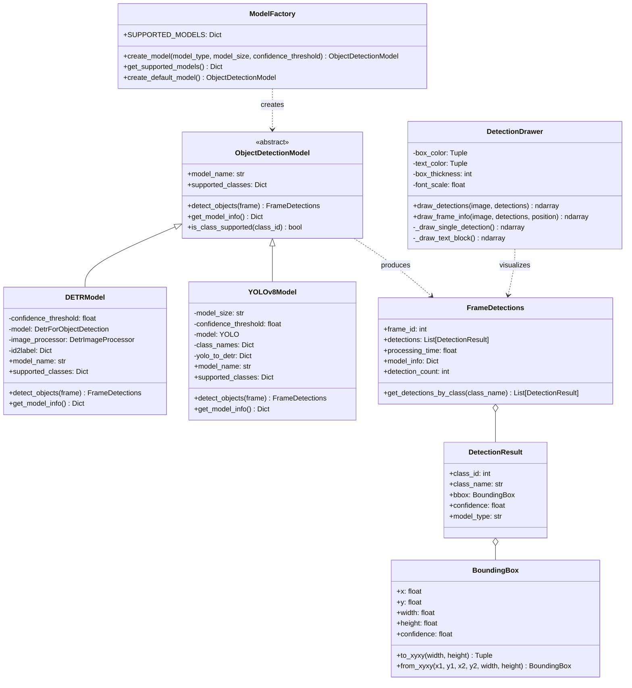
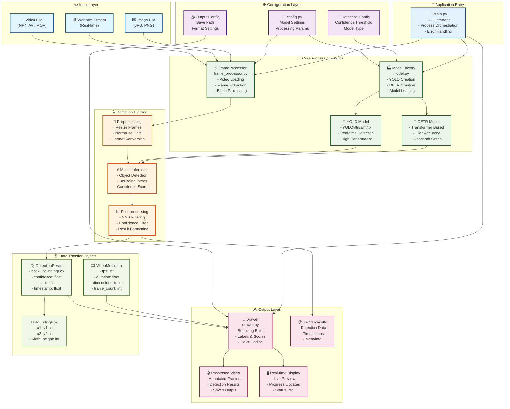
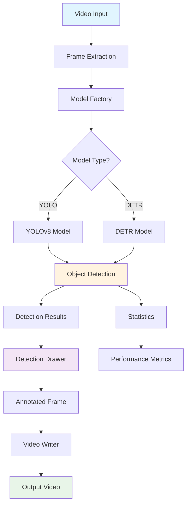
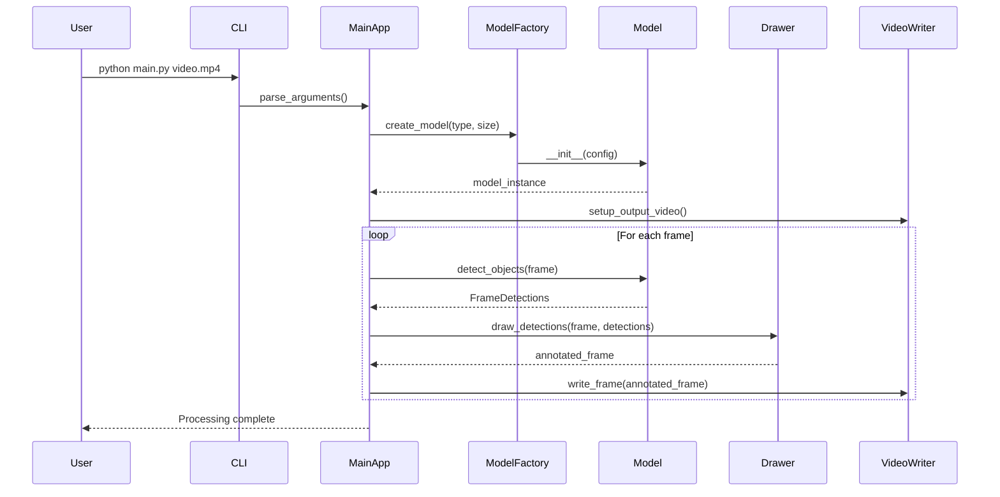
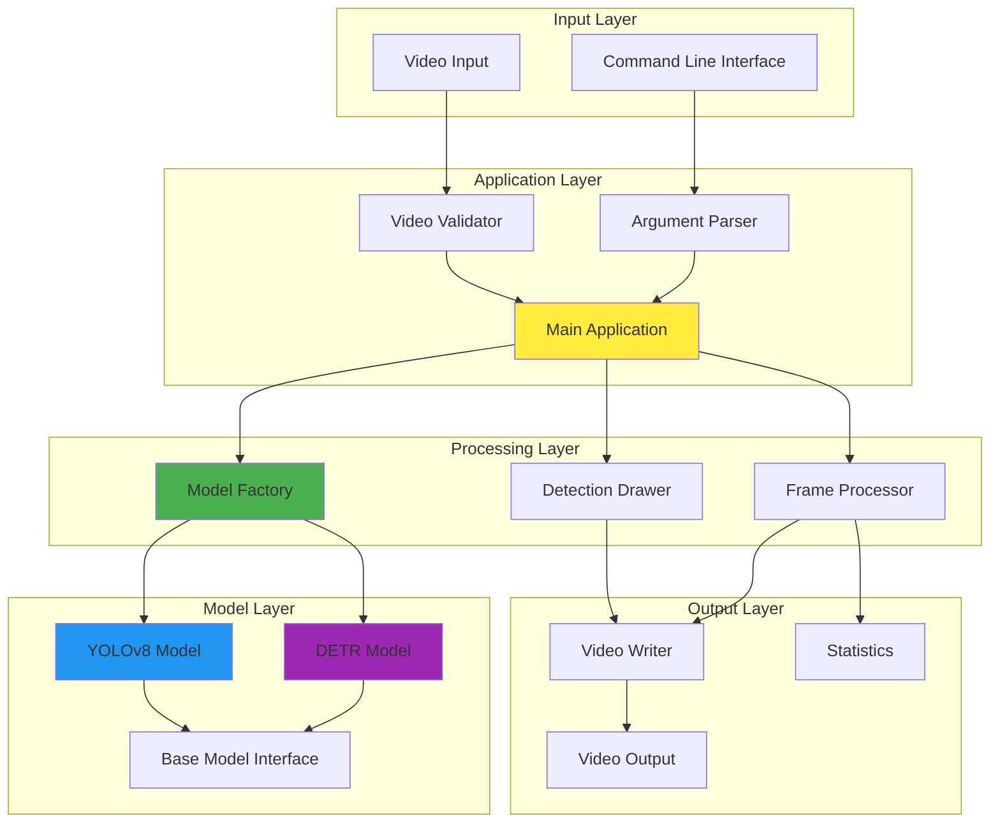

# Architecture Documentation

This document provides a comprehensive overview of the Object Detection Application's architecture, including class diagrams, system architecture, and data flow.

## System Overview

The Object Detection Application is built with a modular, extensible architecture that supports multiple detection models and provides clean separation of concerns.

## Class Architecture



## System Architecture



## Data Flow Diagram



## Model Class Hierarchy

```mermaid
classDiagram
    class ObjectDetectionModel {
        <<abstract>>
        +detect_objects(frame)*
        +get_model_info()*
        +model_name*
        +supported_classes*
    }
    
    class DETRModel {
        +detect_objects(frame) FrameDetections
        +get_model_info() Dict
        +model_name "DETR ResNet-50"
        +supported_classes Dict
        -_load_model()
    }
    
    class YOLOv8Model {
        +detect_objects(frame) FrameDetections
        +get_model_info() Dict
        +model_name "YOLOv8{size}"
        +supported_classes Dict
        -_load_model()
        -_create_class_mapping()
        -_validate_model_size()
    }
    
    ObjectDetectionModel <|-- DETRModel : implements
    ObjectDetectionModel <|-- YOLOv8Model : implements
    
    note for ObjectDetectionModel "Abstract base class defining\nthe interface for all detection models"
    note for DETRModel "Facebook DETR with\nResNet-50 backbone"
    note for YOLOv8Model "Ultralytics YOLOv8\nwith multiple size variants"
```

## Processing Pipeline



## Component Interaction



## Design Patterns Used

### 1. Factory Pattern
- **ModelFactory**: Creates appropriate model instances based on configuration
- **Benefits**: Encapsulates model creation logic, easy to add new models

### 2. Strategy Pattern  
- **ObjectDetectionModel**: Abstract interface for detection strategies
- **DETRModel/YOLOv8Model**: Concrete implementations
- **Benefits**: Interchangeable algorithms, runtime model selection

### 3. Data Transfer Object (DTO)
- **BoundingBox**: Encapsulates bounding box data
- **DetectionResult**: Encapsulates single detection data
- **FrameDetections**: Encapsulates frame-level detection data
- **Benefits**: Type safety, data validation, clear interfaces

### 4. Template Method
- **ObjectDetectionModel.detect_objects()**: Defines detection interface
- **Benefits**: Consistent behavior across implementations

## Performance Considerations

### Model Performance Characteristics
| Model | Inference Time | Memory Usage | Accuracy | Best Use Case |
|-------|----------------|--------------|----------|---------------|
| YOLOv8n | ~1ms | 6MB | 37.3 mAP | Real-time processing |
| YOLOv8s | ~2ms | 22MB | 44.9 mAP | Balanced performance |
| YOLOv8m | ~3ms | 52MB | 50.2 mAP | High accuracy needs |
| YOLOv8l | ~4ms | 87MB | 52.9 mAP | Production accuracy |
| YOLOv8x | ~6ms | 136MB | 53.9 mAP | Maximum accuracy |
| DETR | ~15ms | 159MB | 42.0 mAP | Research applications |

### Optimization Strategies
1. **GPU Acceleration**: Automatic CUDA detection and usage
2. **Batch Processing**: Frame-level processing optimization
3. **Memory Management**: Efficient tensor operations
4. **I/O Optimization**: Streaming video processing

## Extension Points

The architecture supports easy extension through:

1. **New Models**: Implement `ObjectDetectionModel` interface
2. **New Visualizations**: Extend `DetectionDrawer` methods
3. **New Output Formats**: Add new video writers/processors
4. **New Metrics**: Extend statistics collection

## Security Considerations

1. **Input Validation**: All user inputs are validated
2. **File System Security**: Safe file path handling
3. **Memory Safety**: Proper tensor memory management
4. **Error Handling**: Graceful failure modes

This architecture provides a solid foundation for object detection applications while maintaining flexibility for future enhancements and extensions.

## 🏗️ Overview

The Object Detection application follows a modular, extensible architecture with clear separation of concerns. The system is designed around the following core principles:

- **Modularity**: Each component has a single responsibility
- **Extensibility**: Easy to add new models and features
- **Testability**: Components are loosely coupled and easily testable
- **Performance**: Optimized for real-time video processing
- **Maintainability**: Clean code following PEP 8 standards

## 📐 Architecture Diagram

```
┌─────────────────────────────────────────────────────────────┐
│                     Main Application                        │
│                    (main_new.py)                           │
└─────────────────────┬───────────────────────────────────────┘
                      │
┌─────────────────────▼───────────────────────────────────────┐
│                 FrameProcessor                              │
│              (processor/frame_processor.py)                │
│  • Video extraction    • Frame processing                  │
│  • Audio handling      • Result compilation                │
└─────────────┬───────────────────────────┬───────────────────┘
              │                           │
┌─────────────▼──────────────┐  ┌─────────▼────────────────────┐
│      Model Factory         │  │     DetectionDrawer          │
│   (models/factory.py)      │  │  (detection/drawer.py)       │
│  • Model creation          │  │  • Visualization             │
│  • Configuration           │  │  • Annotation drawing        │
└─────────────┬──────────────┘  └──────────────────────────────┘
              │
┌─────────────▼──────────────────────────────────────────────┐
│                  Model Implementations                     │
│                                                            │
│  ┌─────────────────┐  ┌─────────────────┐                │
│  │   DETR Model    │  │   YOLOv8 Model  │                │
│  │ (detr_model.py) │  │ (yolo_model.py) │                │
│  └─────────────────┘  └─────────────────┘                │
│                                                            │
│  ┌─────────────────────────────────────────────────────┐  │
│  │              Base Classes                           │  │
│  │          (models/base.py)                          │  │
│  │  • ObjectDetectionModel (ABC)                      │  │
│  │  • DetectionResult (dataclass)                     │  │
│  │  • BoundingBox (dataclass)                         │  │
│  │  • FrameDetections (dataclass)                     │  │
│  └─────────────────────────────────────────────────────┘  │
└────────────────────────────────────────────────────────────┘
```

## 🧩 Core Components

### 1. Main Application (`main_new.py`)
- **Responsibility**: CLI interface and application orchestration
- **Key Features**:
  - Command-line argument parsing
  - Model configuration and initialization
  - Video processing workflow coordination
  - Result handling and output management

### 2. Model Layer (`models/`)
- **Base Classes** (`models/base.py`):
  - `ObjectDetectionModel`: Abstract base class for all models
  - `DetectionResult`: Structured detection data
  - `BoundingBox`: Normalized bounding box representation
  - `FrameDetections`: Complete frame analysis results

- **Model Implementations**:
  - `DETRModel`: Facebook DETR with ResNet-50 backbone
  - `YOLOv8Model`: Ultralytics YOLOv8 (all size variants)

- **Factory Pattern** (`models/factory.py`):
  - Centralized model creation and configuration
  - Type-safe model instantiation
  - Model capability introspection

### 3. Processing Layer (`processor/`)
- **FrameProcessor** (`processor/frame_processor.py`):
  - Video frame extraction and processing
  - Batch frame analysis coordination
  - Audio preservation and video compilation
  - Performance metrics collection

### 4. Visualization Layer (`detection/`)
- **DetectionDrawer** (`detection/drawer.py`):
  - Bounding box visualization
  - Label and confidence rendering
  - Frame information overlay
  - Customizable visual styling

### 5. Configuration (`config/`)
- **Config Module** (`config/config.py`):
  - Device configuration (CPU/GPU)
  - Class restrictions and mappings
  - Color schemes for visualization
  - Model-specific parameters

## 🎯 Design Patterns

### 1. Abstract Factory Pattern
The `ModelFactory` class provides a unified interface for creating different model types:

```python
model = ModelFactory.create_model('yolo', 'n', confidence_threshold=0.5)
```

### 2. Strategy Pattern
Different detection models implement the same `ObjectDetectionModel` interface:

```python
class ObjectDetectionModel(ABC):
    @abstractmethod
    def detect_objects(self, frame: np.ndarray) -> FrameDetections:
        pass
```

### 3. Data Transfer Objects (DTOs)
Structured data classes for type-safe data transfer:

```python
@dataclass
class DetectionResult:
    class_id: int
    class_name: str
    bbox: BoundingBox
    confidence: float
    model_type: str
```

### 4. Dependency Injection
Components receive their dependencies through constructor injection:

```python
processor = FrameProcessor(model, drawer)
```

## 🔄 Data Flow

1. **Input Processing**:
   ```
   Video File → Frame Extraction → Individual Frames
   ```

2. **Detection Pipeline**:
   ```
   Frame → Model.detect_objects() → FrameDetections
   ```

3. **Visualization Pipeline**:
   ```
   FrameDetections → DetectionDrawer → Annotated Frame
   ```

4. **Output Generation**:
   ```
   Annotated Frames → Video Compilation → Output File
   ```

## 🚀 Performance Considerations

### Model Loading
- Models are loaded once at application startup
- GPU memory is allocated efficiently
- Model weights are cached for subsequent runs

### Frame Processing
- Frames are processed sequentially to maintain memory efficiency
- OpenCV is used for optimized image operations
- Batch processing minimizes model inference overhead

### Memory Management
- Frames are processed and released immediately
- Detection results are lightweight data structures
- Audio streams are handled separately to reduce memory pressure

## 🔧 Extensibility Points

### Adding New Models
1. Implement `ObjectDetectionModel` interface
2. Add model class to `models/` package
3. Register in `ModelFactory.SUPPORTED_MODELS`
4. Update documentation and tests

### Custom Visualization
1. Extend `DetectionDrawer` class
2. Override drawing methods for custom styling
3. Add new visualization options to CLI

### Additional Output Formats
1. Extend `FrameProcessor` with new compilation methods
2. Add format-specific options to CLI
3. Update output handling in main application

## 🧪 Testing Strategy

### Unit Tests
- Each model class has comprehensive unit tests
- Data classes are tested for validation and edge cases
- Factory methods are tested for all supported configurations

### Integration Tests
- End-to-end video processing workflows
- Model interchangeability verification
- Performance benchmarking

### Test Data
- Synthetic test videos for consistent results
- Real-world video samples for validation
- Edge cases: empty videos, corrupted files, etc.

## 📈 Monitoring and Metrics

### Performance Metrics
- Frame processing time per model
- Detection accuracy and confidence distributions
- Memory usage patterns
- GPU utilization (when available)

### Logging
- Structured logging with different levels
- Model loading and initialization events
- Processing progress and completion status
- Error handling and recovery

## 🔒 Security Considerations

### Input Validation
- Video file format validation
- Path traversal prevention
- Memory usage limits

### Model Security
- Model weights are loaded from trusted sources
- Input sanitization for all user-provided data
- Resource limits to prevent DoS attacks

This architecture enables the application to be both powerful and maintainable, with clear extension points for future enhancements.
